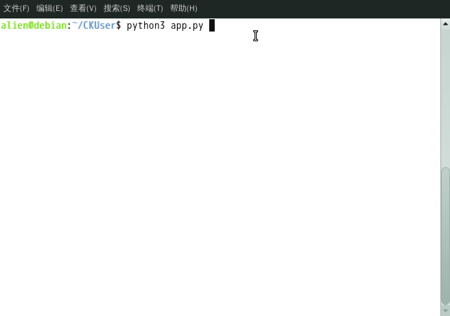

## 一个简单的用户登录脚本
[](https://github.com/ds19991999/CKUser/issues)
[](https://github.com/ds19991999/CKUser/blob/master/LICENSE)

学习数据库写的小`demo`.

## 运行环境
`MySQL5.7、Python3、Redis`

## 文件结构

```
.
├── app.py
├── ckuser
│   ├── client.py
│   ├── config.py
│   ├── __init__.py
│   ├── server.py
│   └── sqlhelper
│       ├── __init__.py
│       ├── MySQLHelper.py
│       └── RedisHelper.py
├── demo.gif
├── LICENSE
├── README.md
└── shell
    ├── client.py
    └── passwd.json
```

配置文件在 `ckuser/config.py`，运行脚本之前先配置好数据库。

## 运行示例


## License
<a rel="license" href="http://creativecommons.org/licenses/by-nc-sa/4.0/"></a>

